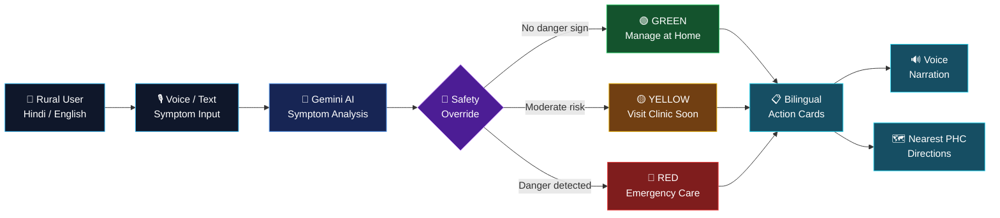

<div align="center">

# 🩺 VitaNova AI

### AI-Powered Bilingual Health Triage for Rural India

**Describe your symptoms. Understand your risk. Know your next step.**

<br/>


</div>

---

<div align="center">

## 🌐 From Symptoms to the Right Care

</div>



---

## 🚦 Interactive Triage Guide

<details>
<summary>🟢 <b>GREEN — Safe to Manage at Home</b></summary>

<br>

Symptoms indicate **low immediate risk** based on the information provided.

### What VitaNova recommends

- Rest and monitor symptoms
- Follow basic self-care guidance
- Monitor for worsening symptoms
- Seek medical care if the condition changes

> VitaNova does not diagnose the condition. It provides preliminary triage guidance only.

</details>

<details>
<summary>🟡 <b>YELLOW — Visit a Clinic Soon</b></summary>

<br>

Symptoms may require **professional medical evaluation**.

### What VitaNova recommends

- Visit your nearest clinic / PHC
- Do not ignore worsening symptoms
- Carry relevant medical information
- Follow the action steps generated by VitaNova

</details>

<details>
<summary>🔴 <b>RED — Emergency</b></summary>

<br>

Potentially serious symptoms have been detected.

### 🚨 Immediate action

**Seek emergency medical care immediately.**

In India, contact emergency services or visit the nearest healthcare facility.

</details>

<details>
<summary>🤰 <b>Pregnancy Safety Override</b></summary>

<br>

VitaNova includes a **deterministic safety layer** independent of the AI-generated severity.

Certain pregnancy danger signs can automatically trigger:

```text
NORMAL AI FLOW
      ↓
Pregnancy danger sign detected
      ↓
SAFETY OVERRIDE
      ↓
🔴 RED — IMMEDIATE CARE
```

Examples include:

- Vaginal bleeding
- Severe headache
- Blurred vision
- Significant swelling
- Other configured pregnancy danger indicators

This mechanism is intentionally implemented at the code level rather than relying solely on the LLM.

</details>

---

<div align="center">

# 🧠 How VitaNova Thinks

</div>

<details open>
<summary>01 — 🗣️ Describe Your Symptoms</summary>

<br>

Users can describe their symptoms using:

- 🇬🇧 English
- 🇮🇳 Hindi
- 🎙️ Voice input
- ⌨️ Text input

Designed for users with limited digital literacy.

</details>

<details>
<summary>02 — 🤖 AI-Guided Questions</summary>

<br>

Gemini analyzes the initial symptoms and generates relevant clarifying questions.

Instead of asking users to understand complicated medical terminology, VitaNova progressively collects the information required for preliminary triage.

</details>

<details>
<summary>03 — 🛡️ Safety Layer</summary>

<br>

Before the final severity is presented, deterministic safety rules are evaluated.

**AI + Code-Level Safety**

```text
User Input
    ↓
Gemini Analysis
    ↓
Safety Rules
    ↓
Final Triage
```

The pregnancy safety override is designed so that critical configured danger signs cannot simply be ignored by the model.

</details>

<details> 
<summary>04 — 🚦 Severity Assessment</summary> 

<br>

VitaNova categorizes the situation into:

| Level | Meaning |
|---|---|
| 🟢 Green | Manage at home |
| 🟡 Yellow | Visit clinic soon |
| 🔴 Red | Seek immediate care |

</details>

<details> 
<summary>05 — 📋 Actionable Guidance</summary> 

<br>

The final result is converted into simple bilingual action cards.

Users receive:

English + हिंदी

at the same time.

</details>

<details> 
<summary>06 — 🗺️ Connect to Care</summary> 

<br>

When professional care is recommended, VitaNova can use location services to help users find the nearest Primary Health Centre.

Symptoms → Triage → Action → Healthcare Facility

</details>

---

## ✨ Core Features

<div align="center">

| 🩺 Feature | 💡 What it does |
|:---:|---|
| 🌐 **Bilingual** | English + Hindi simultaneously |
| 🤖 **AI Triage** | Gemini-powered symptom assessment |
| 🤰 **Safety Override** | Deterministic pregnancy danger detection |
| 🎙️ **Voice Input** | Speak symptoms instead of typing |
| 🔊 **Voice Output** | Hear results in English / Hindi |
| 🚦 **Severity Levels** | Green / Yellow / Red |
| 📋 **Action Cards** | Simple step-by-step recommendations |
| 🗺️ **PHC Locator** | Find the nearest Primary Health Centre |

</div>
